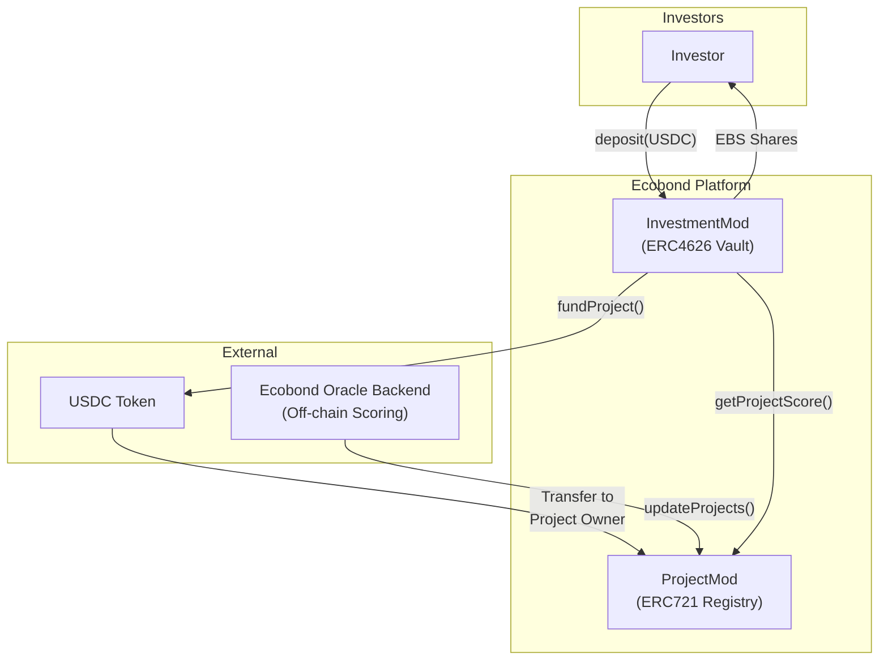
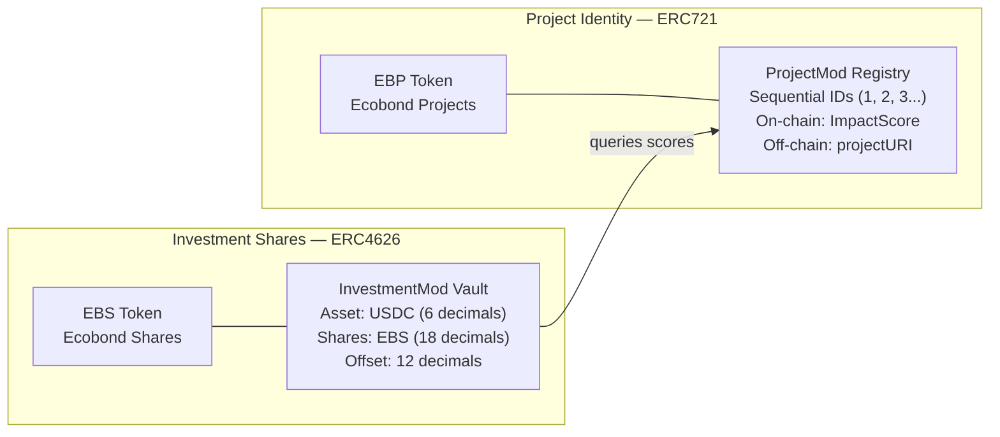
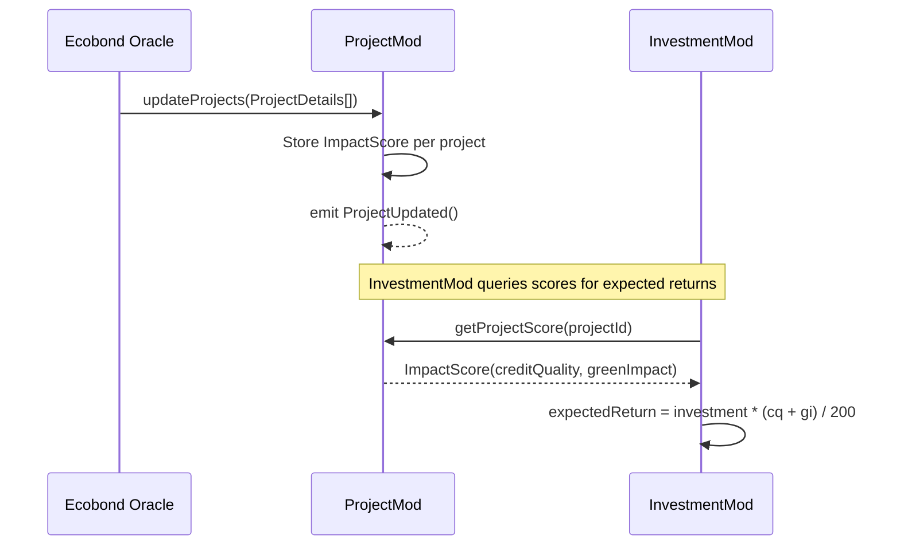
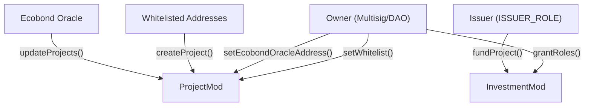

# 🌿 Ecobond — Green Bond Investment Platform

[](https://deepwiki.com/dadadave80/bonds)

A blockchain-based platform that tokenizes environmental projects and manages USDC-backed investments. Ecobond uses a **dual-token architecture** — an ERC4626 vault for fungible investment shares and an ERC721 registry for unique project identities — powered by **Chainlink CRE** for off-chain impact scoring.

---

## Architecture

### Contract Relationships & Token Flow



### Dual-Token System



### Impact Scoring Pipeline



---

## Core Contracts

| Contract | Type | Description |
|---|---|---|
| **`ProjectMod`** | ERC721 + Enumerable + URIStorage | Project registry. Each project is an NFT with on-chain `ImpactScore` and off-chain metadata URI. |
| **`InvestmentMod`** | ERC4626 Vault + OwnableRoles | USDC-backed vault. Investors deposit USDC for shares. Issuer funds projects. `totalAssets()` includes expected returns. |
| **`IProjectMod`** | Interface | Defines the project registry interface with `ImpactScore` and `ProjectDetails` structs. |

### Key Data Structures

```solidity
struct ImpactScore {
    uint8 creditQuality; // 0-100 (financial risk)
    uint8 greenImpact;   // 0-100 (environmental integrity)
}

struct ProjectDetails {
    ImpactScore impactScore;
    uint256 projectId;
    string projectURI;
}
```

### Expected Returns Formula

The vault's `totalAssets()` accounts for expected returns from funded projects:

```
totalAssets = USDC balance + totalInvestments + expectedReturns

expectedReturn(project) = investment × (creditQuality + greenImpact) / 200
```

The average of both impact scores (0–100) is treated as a yield percentage on the invested capital.

---

## Access Control



| Role | Contract | Permissions |
|---|---|---|
| **Owner** | `ProjectMod` | Manage whitelist, set CRE entrypoint |
| **Owner** | `InvestmentMod` | Grant/revoke roles |
| **Issuer** | `InvestmentMod` | Fund projects from vault |
| **Whitelisted** | `ProjectMod` | Create new projects |

---

## Security

- **Oracle Validation** — `CREentrypoint` extends `ReceiverTemplate` with multi-layer validation: forwarder address verification, workflow ID matching, workflow author validation, and workflow name hashing.
- **Transfer Restrictions** — `InvestmentMod` overrides `approve()`, `transfer()`, and `transferFrom()` to revert on zero addresses.
- **Liquidity Guard** — `_beforeWithdraw` ensures the vault has sufficient liquid USDC before allowing redemptions, accounting for capital locked in project investments.
- **Role Isolation** — Solady `OwnableRoles` with `keccak256`-derived role constants for the issuer.

---

## Getting Started

### Prerequisites

- [Foundry](https://book.getfoundry.sh/getting-started/installation)

### Build

```bash
forge build
```

### Test

```bash
forge test
```

### Format

```bash
forge fmt
```

### Deploy

```bash
forge script script/DeployEcobond.s.sol:DeployEcobond \
--rpc-url "https://testnet.hashio.io/api" --chain-id 296 \ # for hedera testnet
--account <KEYSTORE_ACCOUNT> \ # cast wallet account
--sender <SENDER_ADDRESS> \ # optional
--legacy --slow \ # important for hedera
--broadcast \
--verify # optional
```

---

## Project Structure

```
src/
├── InvestmentMod.sol          # ERC4626 USDC vault
├── ProjectMod.sol             # ERC721 project registry
├── interfaces/
│   ├── IProjectMod.sol        # Project registry interface
test/
├── InvestmentMod.t.sol
├── ProjectMod.t.sol
└── mock/
    └── MockUSDC.sol
script/
└── DeployEcobond.s.sol
```

---

## Contract Addresses

- ProjectMod - [0.0.8324622-azcyc](https://hashscan.io/testnet/contract/0.0.8324622)
- InvestmentMod - [0.0.8324627-atpkj](https://hashscan.io/testnet/contract/0.0.8324627)
- USDCMock - [0.0.8324626-sjscs](https://hashscan.io/testnet/contract/0.0.8324626)

---

## Dependencies

- [OpenZeppelin Contracts](https://github.com/OpenZeppelin/openzeppelin-contracts) — ERC721, ERC20
- [Solady](https://github.com/Vectorized/solady) — ERC4626, OwnableRoles, SafeTransferLib
- [Forge Std](https://github.com/foundry-rs/forge-std) — Testing utilities

---

## License

MIT
